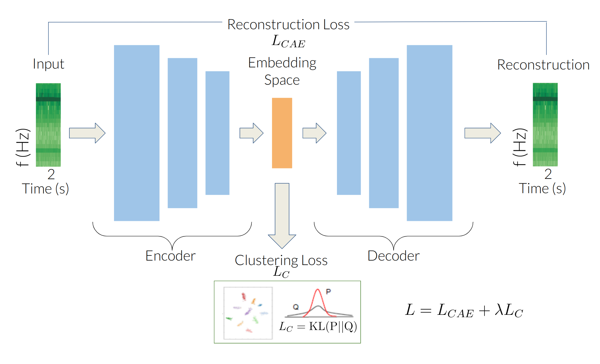

# Clustering of Spectrogram Cubes

This project implements a clustering workflow inspired by the methodology described in the [paper](https://doi.org/10.1029/2021JB021716) published in the 
Journal of Geophysical Research: Solid Earth.  The aim is to group spectrogram cubes in a meaningful way by leveraging 
deep learning techniques, with applications in geophysical research.

***

### Clustering Workflow
To perform **Deep Embedded Clustering (DEC)**, the workflow follows these steps:
1. **Pretraining an Autoencoder:** The autoencoder is trained to extract the most essential features from the spectrogram data samples, reducing dimensionality while retaining important information.
2. **Gaussian Mixture Model (GMM) in Latent Space:** Once the data is encoded into the latent space by the autoencoder, a GMM is applied to identify and group clusters. This helps in discovering distinct patterns or classes within the data.
3. **Cluster Assignment and Refinement:** The initial cluster assignments from the GMM are refined using DEC, further optimizing the clustering to improve separation and cohesiveness.

<p align="center">
    
    <br>
    Deep Embedded Clustering Approach.
</p>


***

### Pre-requisites

To set up the environment for running the code, follow these steps:

1. Install [Anaconda](https://anaconda.org) if you haven't already.
   
2. Set up the environment:
   - For a **CUDA environment** (for GPU acceleration):  
     ```bash
     conda env create -f RISCluster_CUDA.yml
     ```
   - For a **CPU-based environment**:  
     ```bash
     conda env create -f RISCluster_CPU.yml
     ```
***

### Execution

To run the complete clustering workflow, follow these steps:

1. **Train the Autoencoder**:  
   Run the following command to pretrain the autoencoder:  
   ```bash
   python3 AEC_train.py
   ```
2. **Initialize DEC with GMM Centroids**:  
   To initialize the DEC process by generating centroids using GMM, execute:
   ```bash
   python3 GMM_centroids.py
   ```
3. **Perform Deep Embedded Clustering**:  
   Run this command to start the DEC process and refine the clusters:
   ```bash
   python3 DEC_train.py
   ```


***

### Note
For performing distributed training switch to branch dev_ddp

***

### References
William F. Jenkins II, Peter Gerstoft, Michael J. Bianco, Peter D. Bromirski; *[Unsupervised Deep Clustering of Seismic Data: Monitoring the Ross Ice Shelf, Antarctica.](https://onlinelibrary.wiley.com/share/author/QI3MB3SGBPRGJISHRJGJ?target=10.1029/2021JB021716)* Journal of Geophysical Research: Solid Earth, 30 August 2021; doi: https://doi.org/10.1029/2021JB021716

Dylan Snover, Christopher W. Johnson, Michael J. Bianco, Peter Gerstoft; *Deep Clustering to Identify Sources of Urban Seismic Noise in Long Beach, California.* Seismological Research Letters 2020; doi: https://doi.org/10.1785/0220200164

Junyuan Xie, Ross Girshick, Ali Farhadi; *Unsupervised Deep Embedding for Clustering Analysis.* Proceedings of the 33rd International Conference on Machine Learning, New York, NY, 2016; https://arxiv.org/abs/1511.06335v2

Please refer to the [RISWorkflow repository](https://github.com/NeptuneProjects/RISWorkflow) for detailed instructions on how to implement the workflow.

***

